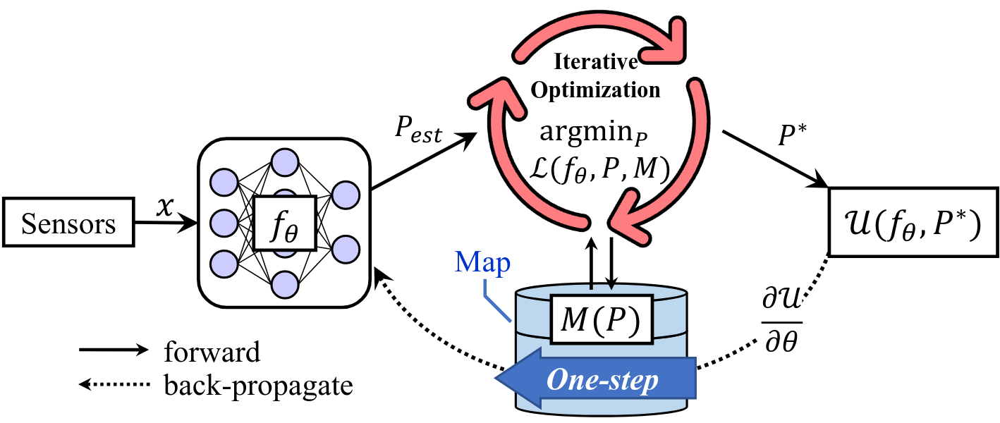
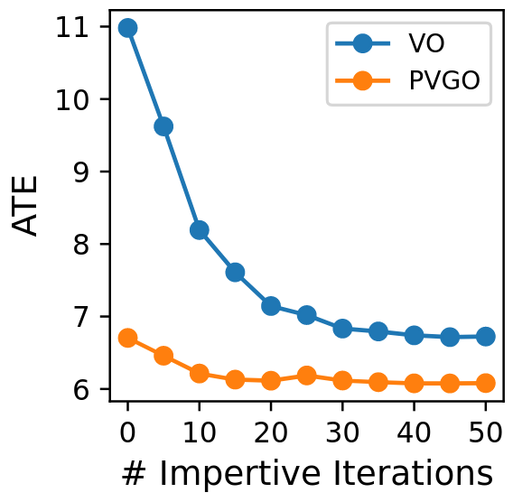
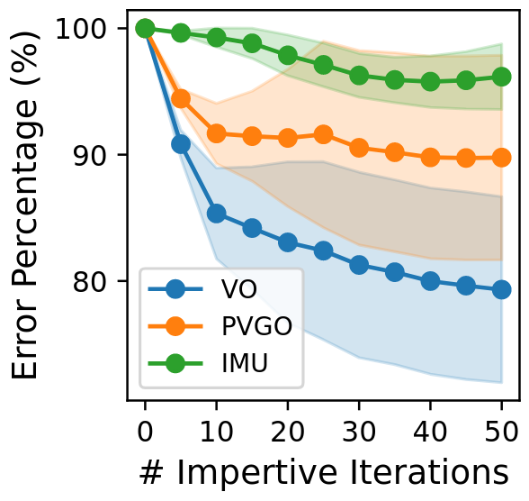
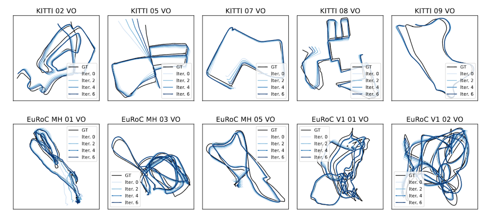

# iSLAM: Imperative SLAM

iSLAM is a novel self-supervised imperative learning framework for SLAM tasks. It fosters reciprocal correction between the front-end and back-end, thus enhancing performance without necessitating any external supervision. 


We formulate the SLAM problem as a **bi-level optimization** in which the front-end and back-end are bidirectionally connected. As a result, the front-end model can learn global geometric knowledge obtained through pose graph optimization by back-propagating the residuals from the back-end component. This framework is named "imperative" SLAM to emphasize the passive nature of this learning process



Our framework significantly improves the system's trajectory prediction accuracy and generalization ability, achieving an accuracy improvement of 22% on average over a baseline model. To the best of our knowledge, iSLAM is the first SLAM system showing that the front-end and back-end can mutually correct each other in a self-supervised manner.

## Related Papers

**iSLAM: Imperative SLAM**, Taimeng Fu, Shaoshu Su, Yiren Lu, and Chen Wang, *IEEE Robotics and Automation Letters (RA-L)*, 2024. [PDF](https://arxiv.org/pdf/2306.07894.pdf).

Please cite us as:
```
@article{fu2024islam,
  title = {{iSLAM}: Imperative {SLAM}},
  author = {Fu, Taimeng and Su, Shaoshu and Lu, Yiren and Wang, Chen},
  journal = {IEEE Robotics and Automation Letters (RA-L)},
  year = {2024}
}
```

## Experiment Results

We test our framework on [KITTI](https://www.cvlibs.net/datasets/kitti/), [EuRoC](https://projects.asl.ethz.ch/datasets/doku.php?id=kmavvisualinertialdatasets) and [TartanAir](https://theairlab.org/tartanair-dataset/) benchmarks, which have distinctive motion patterns and environment features. 
It is seen that after several iterations, the ATE of the front-end VO and IMU models reduced by 22% and 4% on average, respectively. Meanwhile, the accuracy of the PVGO back-end also improves by about 10%.




The figure below visually demonstrates the improvement in trajectory estimation of the VO model through imperative learning.



## More Info

Video: https://www.youtube.com/watch?v=rtCvx0XCRno

Webpage: https://sairlab.org/iSLAM/

## Run Code

### Create Conda Environment

Please use the `environment.yml` we provided.

```
conda env create -f environment.yml
```

### Prepare Data

#### KITTI

We test our framework on the trajectories in KITTI Odometry. However, as KITTI Odometry does not contain IMU data, we downloaded [KITTI Raw](https://www.cvlibs.net/datasets/kitti/raw_data.php) instead. The mapping between the two is:

```
00: 2011_10_03_drive_0027 000000 004540
01: 2011_10_03_drive_0042 000000 001100
02: 2011_10_03_drive_0034 000000 004660
03: 2011_09_26_drive_0067 000000 000800
04: 2011_09_30_drive_0016 000000 000270
05: 2011_09_30_drive_0018 000000 002760
06: 2011_09_30_drive_0020 000000 001100
07: 2011_09_30_drive_0027 000000 001100
08: 2011_09_30_drive_0028 001100 005170
09: 2011_09_30_drive_0033 000000 001590
10: 2011_09_30_drive_0034 000000 001200
```

We use the synchronized images and raw IMU data (as the synchronized IMU is only 10Hz, while the raw IMU is 100Hz). So you need to download both and replace the `oxts` folder in the synchronized data with the one in the raw data. We prepared a script at `./tools/replace_imu.py` to facilitate the replacement.

#### EuRoC

Please download EuRoC [here](https://projects.asl.ethz.ch/datasets/doku.php?id=kmavvisualinertialdatasets).

#### TartanAir

We test on the Hard sequences of Ocean and Soulcity enviroments in TartanAir. Please download them [here](https://theairlab.org/tartanair-dataset/).

### Download Pretrain Model

Please download the pre-trained models [here](https://buffalo.box.com/s/iki2viq18qjbtlis2s2jwh15refl5c41) and put it in `./models`.

### Run Scripts

We provide scripts `run_kitti.sh`, `run_euroc.sh`, and `run_tartanair.sh`. Please open and change `data_dir` to the path of a specific sequence on your computer. The trajectory estimation results will be stored in `./train_results/${project_name}/${train_name}` while the trained models will be saved to `./train_results_models/${project_name}/${train_name}`, so you may also change these variables to specify the output path.

After getting everything ready, just run:

```
sh run_kitti.sh
sh run_euroc.sh
sh run_tartanair.sh
```

## Acknowledgements

This work was in part supported by the ONR award
N00014-24-1-2003. Any opinions, findings, conclusions, or
recommendations expressed in this paper are those of the
authors and do not necessarily reflect the views of the ONR.
The authors also wish to express their gratitude for the
generous gift funding provided by Cisco Systems Inc.
